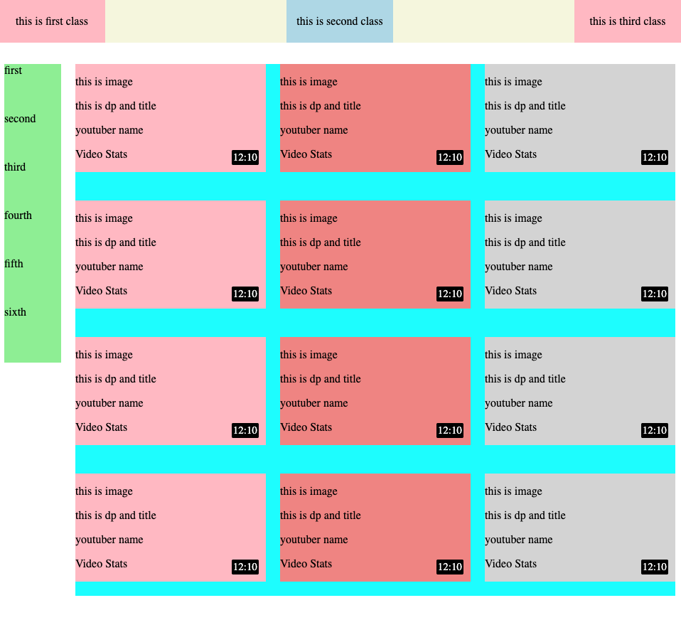

# YouTube Lite 🎬 — Frontend Clone Using Pure HTML & CSS
1. **Prototype First**: Started by building `flexbox.html` with placeholder sections to define structure using Flexbox.
2. **Final Integration**: Migrated the flex layout into `youtube.html`, replacing placeholders with actual content such as thumbnails, titles, and metadata.
3. **Styling Enhancements**:
   - Applied `flex-shrink: 0`, `min-width`, and media queries for responsive control.
   - Integrated custom components like a horizontal and vertical guide line to enhance visual balance.
4. **Responsive Fixes**: Ensured mobile responsiveness using media queries and width adjustments for `.second` and `.third` containers.
5. **Clickable Enhancements**: Enabled redirection on thumbnails by wrapping `` tags in anchor links.

## 💡 Features

- Fully responsive design using Flexbox.
- Interactive hover effects and clickable thumbnails.
- Vertical and horizontal guide lines aligned with layout.
- Minimalist and semantic HTML/CSS code structure.

## 📸 Screenshots

### Initial Template (flexbox.html)

### Final Output (youtube.html)

---

Made with ❤️ by Faiz Ahamed Shaik
